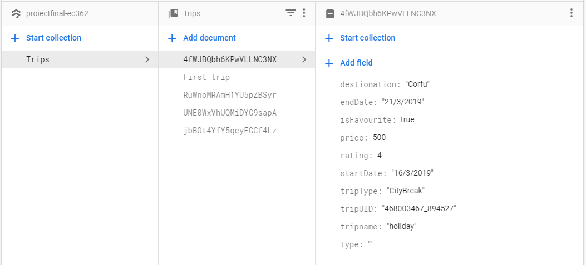
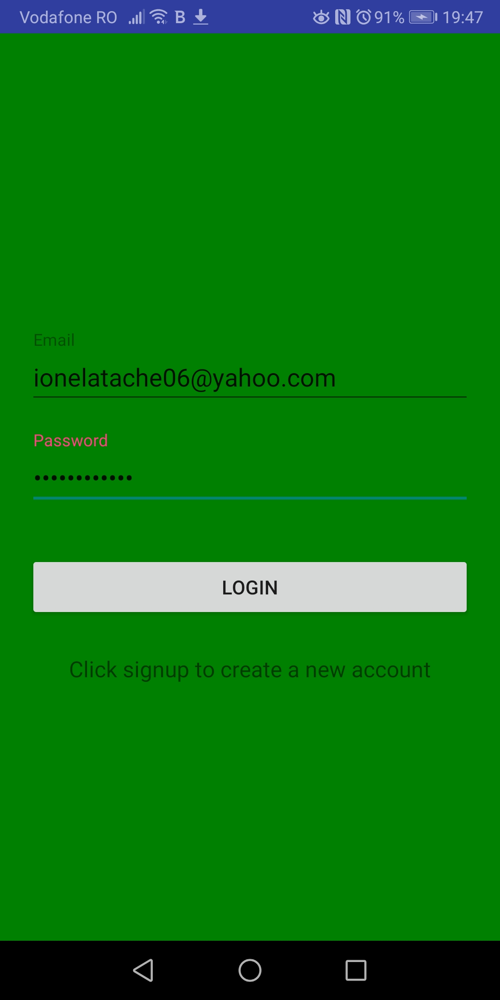
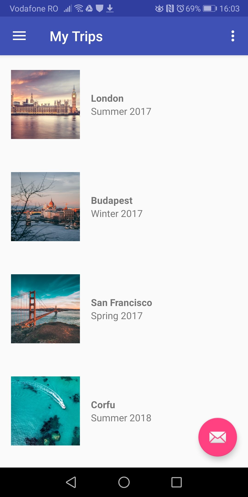
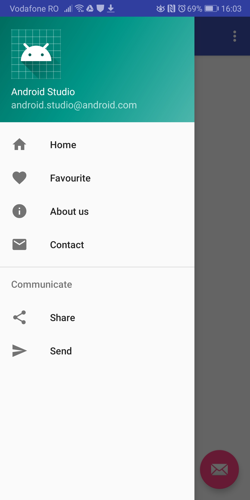
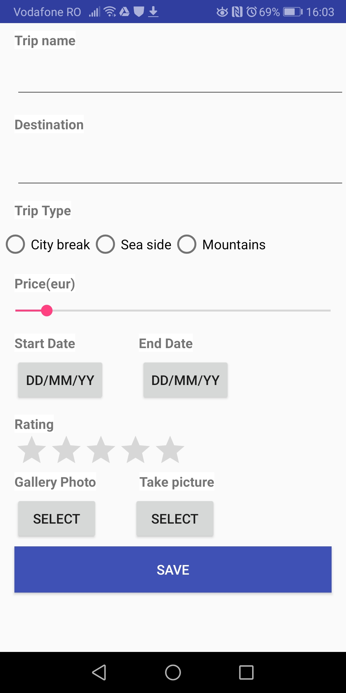

# Firebase was used in oreder to save data in the app

# User can authenticate with a google account

# Main activity contains a recycler view that displays a list of trips, along with a name and a picture

# It also contains a navigation drawer with options for Home, Favourite, About Us, Contact, Share, Send

# When adding a new trip, following details must be filled in

   
